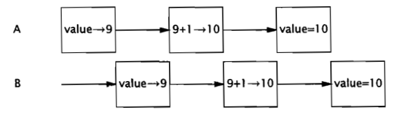

# 并发简史

并发是基于以下原因：

1. 资源利用率
2. 公平性
3. 便利性

串行的优势： 直观性 和 简单性，因为它模仿了人类的工作方式。

线程允许 在同一个进程中 同时存在多个程序控制流，线程被称为轻量级进程。

# 线程优势

1. 降低程序的开发和维护成本，同时提升复杂程序的性能
2. 垃圾收集器通常在一个或者多个专门的线程中执行

## 发挥多处理器的强大能力

1. 如果在拥有100个处理器的系统上，执行单线程 程序，将会99%的资源无法利用、
2. 使用多线程还可以在单处理器系统上获得更高的吞吐率。

## 建模的简单性

1. 如果程序中只包含一种类型的任务，那么比包含多种类型的程序更容易编写,错误更少，更容易测试。

2. 为模型中每种类型的任务都分配一个专门的线程，那么可以形成一种串行执行的假象。

## 异步事件的简化处理

1. 为了避免卡顿，单线程服务器必须使用 非阻塞I/O，这种 I/O 的复杂性要远 高于同步 I/O.
2. 操作系统提供了一些高效的方法来实现 多路 I/O。

## 相应更灵敏的用户界面

1. 传统 GUI 应用程序通常都是单线程的
2. 现代 GUI 应用程序都有一个 事件分发线程

# 线程的风险

## 安全性  (永远不要发生糟糕的事情)

没有充分同步的情况下，多线程中的执行顺序是不确定的。

```java
@NotThreadSafe
public class UnSafeSequence {

  private int value;

  public int getNext(){
    return value++;
  }
}
```

上面的代码，多线程执行可能出现如下情况：



这是一种常见的并发安全性问题，称为竞态条件。

## 活跃性问题 (某件正确的事情最终会发生)

常见活跃性问题：

1. 无意的无限循环，使得循环后的代码无法执行
2. 死锁，饥饿，以及活锁

## 性能问题 (正确的事情尽快发生)

1. 服务时间过长，相应不灵敏，吞吐率过低，资源消耗过高,或者可伸缩性较低等

# 线程无处不在

JVM启动时，会为内部任务（垃圾收集，终结）创建后台进程，并创建一个主线程来运行 main 方法。

一些需要线程安全的程序： Timer，Servlet和JSP