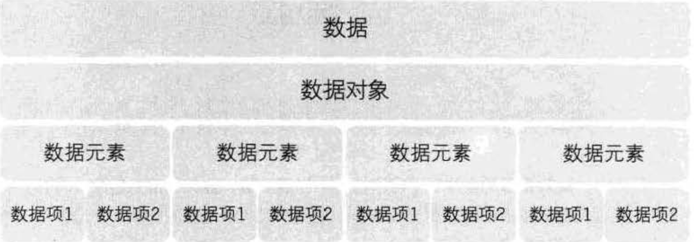
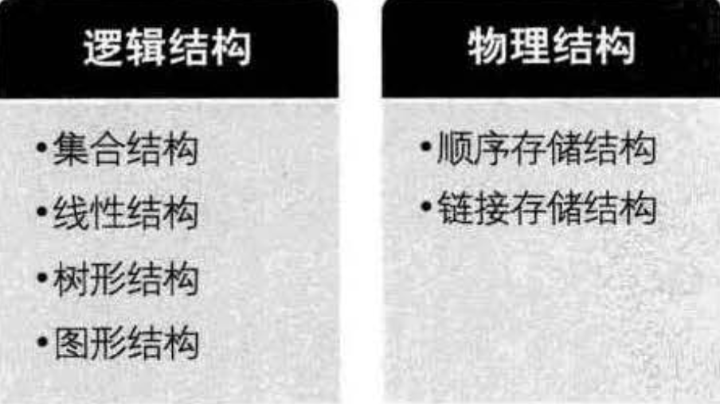

## 概述
数据结构：是相互之间存在一种或多种特定关系的数据元素的集合。

## 概念与术语

- 数据： 是描述客观事物的符号，是计算机中可以操作的对象，是能被计算机识别，并输入给计算机处理的符号集合。
- 数据元素： 是组成数据的、有一定意义的基本单位，在计算机中通常作为整体处理，也被称作记录。
- 数据项：一个数据元素可以由若干个数据项组成，数据项是数据不可分割的最小单位。
- 数据对象： 是性质相同的数据元素的集合，是数据的子集。
- 数据结构： 分析处理对象的特性及个对象之间的关系。

## 逻辑结构与物理结构

### 逻辑结构

数据对象中数据元素之间的相互关系。
1. 集合结构：数据元素间除了同属于一个集合外，他们之间没有其他关系。
2. 线性结构：数据元素间是一对一的关系
3. 树性结构：数据元素间存在一对多的层次关系
4. 图结构： 数据元素间是多对多的关系

### 物理结构

数据的逻辑结构在计算机中的存储形式。

1. 顺序存储结构：把数据元素存放在地址连续的存储单元里，其数据间的逻辑关系和物理关系是一致的。
2. 链式存储结构：把数据元素存放在任意的存储单元里，这组存储单元可以是连续的，也可以是不连续的。

## 抽象数据类型

### 数据类型
一组性质相同的值的集合及定义在此集合上的一些操作的总称。

在C语言中，数据类型分为
- 原子类型：是不可再分解的基本类型，如整型，字符型。
- 结构类型： 若干个类型组合而成，是可以再分解的，如数组。

### 抽象数据类型
一个数学模型及定义在该模型上的一组操作。抽象的意义在于数据类型的数学抽象特性。

## 总结

 
 

