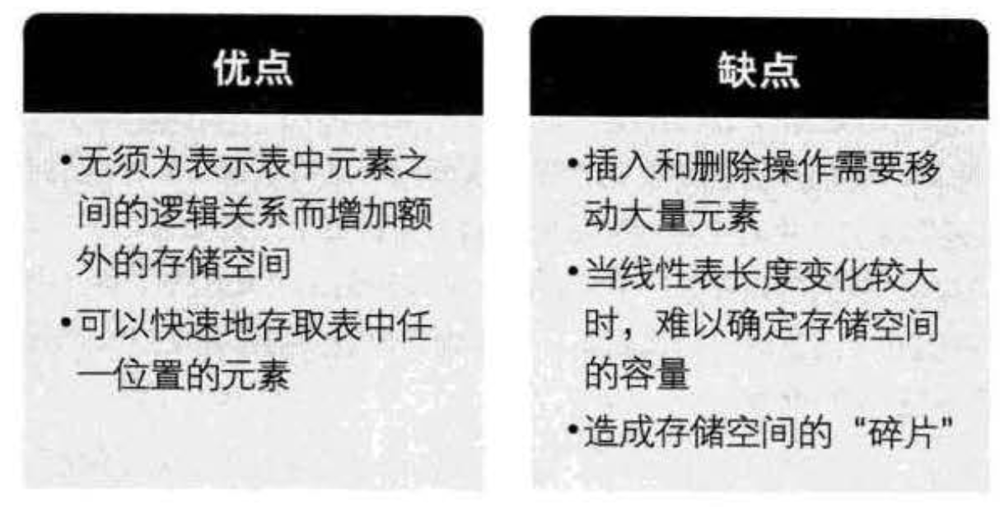
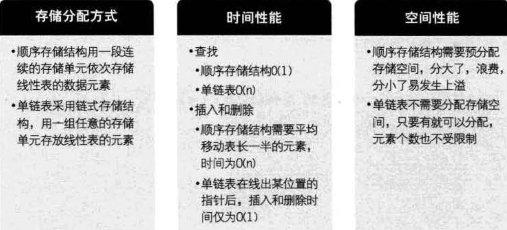
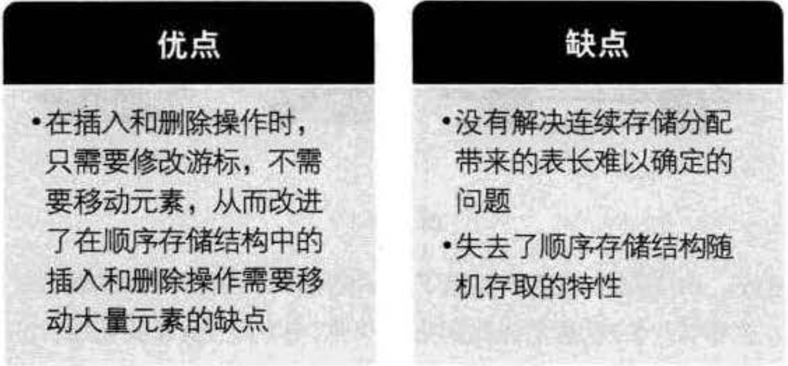
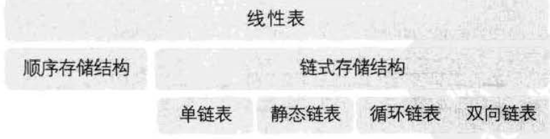

## 概述

线性表（List）：零个或多个数据元素的有限序列。

线性表的元素个数`n（n>0）`定义为线性表的长度，`n=0`时，为空表。

## 线性表的顺序存储结构

- 顺序存储定义： 用一段地址连续的存储单元依次存储线性表的数据元素
- 顺序存储方式： 用一维数组来实现顺序存储结构
- 数据长度与线性表长度： 任意时刻，线性表的长度应该小于等于数组的长度
- 地址计算方法： 存储器中的每个存储单元都有自己的编号，这个编号称为地址

### 顺序结构的插入与删除

####  插入

-  如果插入位置不合理，抛出异常
-  如果线性表长度 > 数组长度，抛出异常
-  从最后一个元素向前遍历到第 i 个位置，分别都将他们向后移一个位置
-  将要插入的元素插入 i 位置
-  表长度 +1

#### 移除

- 如果删除位置不合理，抛出异常
- 取出删除元素
- 从去除元素位置 i 开始遍历到最后 一个元素，分别将他们向前移一个位置
- 表长  -1

> 线性表 `存读数据` 操作，不管是哪个位置，时间复杂度都是 O(1)
> `插入和删除`操作，时间复杂度则为 O(n).

### 顺序存储结构的优缺点

## 线性表的链式存储结构

- 顺序存储的不足：顺序存储结构在插入和删除时需要移动大量元素，链式结构就是为了解决这个问题的。

### 链式存储结构定义

用一组任意的存储单元存储线性表的数据元素，这组存储单元可以是连续的，可以是不连续的。

- 我们把存储数据元素信息的域称为数据域，
- 把存储直接后继位置的域称为指针域，指针中存储的信息称为指针或链，指向其后继元素的存储地址
- 数据域和指针域两部分信息构成一个节点。
- n个节点构成一个单链表，因为每个节点只包含一个指针域，因此称为单链表
- 单链表的第一个节点前会附设一个节点：`头结点（数据域不存储任何信息）`，最后一个节点指针为 NULL。
- 我们把链表中第一个节点的存储位置叫做`头指针`，整个链表的存取必须从`头指针`开始
- 链式结构中，每个数据元素，需要存储它的后继元素的存储地址。

### 头节点与头指针的异同

### 单链表读取
从头开始找，直到第 i 个元素为止。

最好的情况是 i = 1，不需要遍历
最坏的情况 i = n，时间复杂度 O(n)

### 单链表插入、删除

只需要改变 插入位置 前后的节点，改变其指针域就可以了

插入与删除操作，其实有两部分组成

-   遍历和查找第 i 个元素
-   插入和删除元素

## 单链表 与 顺序表 比较

### 经验总结

- 若线性表需要频繁查找，很少进行插入与删除操作时，宜采用顺序存储结构，
- 若元素个数变化较大或者根本不知道有多大时，最好采用单链表结构。

##  静态链表

我们把用数组描述的链表叫静态链表，而这种描述方法称为游标实现法。

### 静态链表的优缺点

## 循环链表

将单链表的终端结点的指针由空改为指向头结点，使得整个单链表形成一个环。
这种头尾相接的单链表称为单循环链表，简称`循环链表`.

## 双向链表

在单链表的每个节点中，再设置一个指向其前驱节点的指针域。
在双向链表的结点中有两个指针域， 其一指向直接后继，另一指向直接前驱。

## 总结

线性表的数据结构分类：

