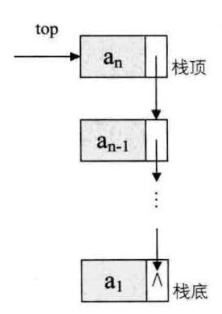

## 概念

栈(Stack)： 限定仅在表尾进行插入和删除操作的线性表。

队列(Queue)： 只允许在一段进行插入操作，而在另一端进行删除操作的线性表。

## 栈

-   后进先出的线性表，简称LIFO
-   把允许插入和删除的一端称为栈顶，另一端称为栈底
-  不含任何数据元素的栈称为空栈
-  栈的插入操作，叫做进栈，也称压栈、入栈
-  栈的删除操作，叫做出栈，也称弹栈。

### 栈的顺序存储结构

栈是线性表的特例，栈的顺序存储结构其实就是线性表的顺序存储结构。

### 两栈共享空间

### 栈的链式存储结构

### 顺序栈与链栈
顺序栈： 栈的顺序存储结构
链栈： 栈的链式存储结构

- 顺序栈与链栈的时间复杂度均为 O(1)
- 顺序栈存取定位方便，顺序栈需要事先确定一个固定长度，可能造成空间浪费

### 栈的应用

递归(斐波那契数列问题)： 直接调用自己或者通过语句间接调用自己的函数。
逆波兰表示法(四则运算表达式求值)： 一种不需要括号的后缀表达式。需要配合栈的特性进行求值。

## 队列

-  一种先进先出的线性表，简称FIFO
-  允许插入的一端陈为队尾，允许删除的一端称为队头。
-  入队的时间复杂度为O(1),出队为了保持表头不为空，一般时间复杂度为 O(n).

### 顺序存储结构的不足

入队操作，不需要移动任何元素，时间复杂度为(1)，
出队操作，所有元素都得向前移动，时间复杂度为O(n).

顺序队列的不足：出队时，队列中的所有元素都得向前移动。

### 循环队列

为了避免顺序队列的不足，这里引入了两个指针，就是循环队列，
循环队列是队列的头尾相接的顺序存储结构，
但是这样会有假溢出出现的可能。

### 链队列

队列的链式结构其实就是单链表，只能尾进头出。
只是其满足FIFO

- 链队列和循环队列的时间复杂度都为 O(1),只是循环队列需要事先申请好空间。

## 总结

