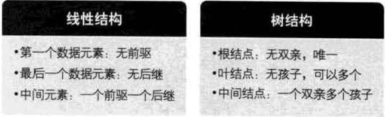
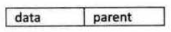
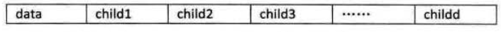
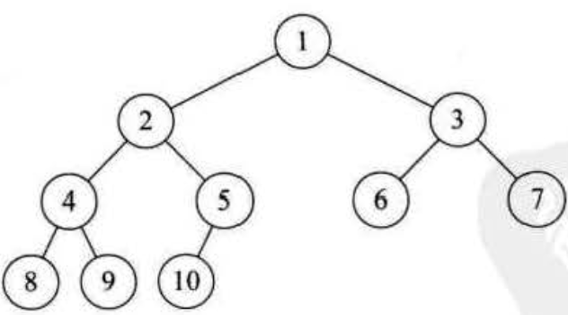
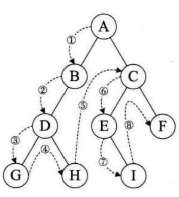
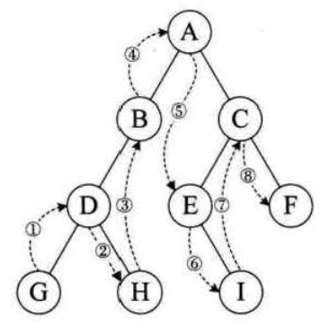
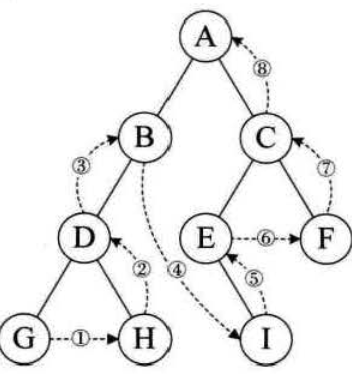
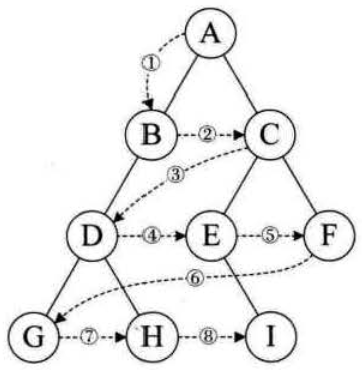

## 概述

是n(n=>0)个节点的有限集。

-  N=0时成为空树
-  任意一颗非空树中，有且仅有一个根节点(Root)
-  当n>0时，其余节点可分为m(m>0)个互不相交的有限集T1,T2,...
-  其中每一个集合本身又是一棵树，并且称为根的子树，（SubTree）

## 节点

### 节点分类

节点的度(Degree)：节点拥有的子树个数。

-  度为0的称为终端节点或者叶节点(Leaf)
-  度不为0的称为非终端节点或者分支节点(Child)，分支节点也称为内部节点

### 节点间的关系

-  节点的子树的根称为该节点的孩子（Child）。相应的，该节点称为孩子的双亲。（Parent）
-  同一双亲的孩子之间互称为兄弟
-  从根到该节点所经历的所有节点称为其 祖先，反之，即子孙。

### 数的其他概念

-  节点的层次从根开始定义起，根为第一层，根的孩子为第二层
-  节点的最大层次称为 树的深度 或者 高度。
-  如果将树中节点的各子树看成是从左到右是有次序的，不能互换的，则称该树为有序树，否则称为无序树。
-  森林是m（m>0）棵互不相交的 树的集合。

## 线性结构与树形结构

## 树的存储结构

### 双亲表示法

除了跟节点，每个节点不一定有孩子，但一定有父母。

- 每个节点中，附设一个指示器指示其双亲节点到链表中的位置
- 可以根据每个节点的parent指针找到双亲节点，时间复杂度为O(1)

存储结构的设计是一个非常灵活的过程。需要考虑运算方便与时间复杂度等。

### 孩子表示法

每个节点有多个指针域，每个指针域可以指向一颗子树的根节点，我们把这种表示法叫：多重链表表示法。

- 把每个节点的孩子节点排列起来，以单链表作为存储结构。
- n个节点有n个孩子链表，如果是叶子节点则此单链表为空。
- n个头指针又组成一个线性表，采用顺序存储结构，存放在一个一维数组中。

### 孩子兄弟表示法

任意一棵树，它的节点的第一个孩子如果存在就是唯一的，它的右兄弟如果存在也是唯一的

- 设置两个指针分别指向该节点的第一个孩子和此节点的右兄弟

## 二叉树

二叉树（Binary Tree）是n(n>=0)个节点的有限集合。该集合或者为空集（称为空二叉树），或者由一个根节点和两颗互不相交的、分别称为根节点的左子树、右子树的二叉树组成。

二叉树的特点：

-  每个节点最多有两棵子树，不存在度数大于2的节点。
-  左子树和 右子树是有顺序的
-  即使树中只有一棵子树，也要区分它是左子树还是右子树。

二叉树的五种基本形态：

-  空二叉树;
-  只有一个根节点;
-  根节点只有左子树;
-  根节点只有右子树;
-  根节点既有左子树又有右子树。

### 特殊二叉树

- 斜数： 所有的节点 都只有左子树或者右子树。
- 满二叉树： 所有分支节点都存在左子树和右子树，并且所有叶子都在同一层上。
- 完全二叉树： 编号为 i(1<=i<=n)的节点与同样深度的满二叉树中编号为 i 的节点在二叉树中位置完全相同。如下所示：

### 二叉树的性质

-  在二叉树的第i层上最多有2 i-1 个节点 。（i>=1）
-  二叉树中如果深度为k,那么最多有2k-1个节点。
-  n0=n2+1：n0表示终端节点数， n2表示度为2的节点数。
-  完全二叉树中，具有n个节点的完全二叉树的深度为[log2n]+1，其中[log2n]+1是向下取整。
- 若对含 n 个结点的完全二叉树从上到下且从左至右进行 1 至 n 的编号，则对完全二叉树中任意一个编号为 i 的结点：

> 若 i=1，则该结点是二叉树的根，无双亲, 否则，编号为 [i/2] 的结点为其双亲结点;  
> 若 2i>n，则该结点无左孩子，  否则，编号为 2i 的结点为其左孩子结点；
> 若 2i+1>n，则该结点无右孩子结点，  否则，编号为2i+1 的结点为其右孩子结点。

### 二叉树的存储结构

#### 顺序存储结构

顺序存储结构一般只用于完全二叉树二叉树的链式存储结构

#### 二叉链表

二叉树的每个节点最多有两个孩子，所以为他设计一个 数据域和两个指针域 是比较自然的想法，我们称之为 二叉链表

## 遍历二叉树

从根节点触发，按照某种次序依次访问二叉树中所有节点，使得每个节点被访问一次且仅被访问一次。

### 二叉树的遍历方法：
#### 前序遍历（根左右）、

#### 中序遍历（左根右）、

#### 后序遍历（左右根）、

#### 层序遍历。

## 二叉树建立

建立二叉树主要是利用递归的原理，如前面的遍历，只不过在原来打印的位置改成 生成节点，给节点赋值而已。

## 线索二叉树

指向前驱或者后继得指针称为线索，加上线索的二叉树链表称为线性链表，相应的二叉树就称为线索二叉树。

如果 所用的二叉树 需要经常遍历或者查找节点时，需要某种遍历序列中的 前驱和后继。采用线索二叉树就不错。

对二叉树以某种次序遍历使其变为线索二叉树的过程称为线索化。
实质就是将二叉树中的空指针改为指向前驱和后继的线索。
> 线索化的过程就是在遍历的过程中修改空指针的过程。

##  树、森林、二叉树的相互转化

树 --> 二叉树：（1）加线，（2）去线，（3）层次调整。

森林 --> 二叉树： （1）把每个树转化为二叉树，（2）把后续每棵二叉树的跟节点作为前一棵的右节点

二叉树 --> 树： （1）加线，（2）去线，（3）层次调整。

二叉树 --> 森林：
（1）先把每个结点与右孩子结点的连线删除，得到分离的二叉树；
（2）把分离后的每棵二叉树转换为树；
（3）整理第（2）步得到的树，使之规范，这样得到森林。

## 赫夫曼树

路径： 从树中的一个节点到另一个节点之间的分支构成两个节点之间的路径。路径上的分支数目称作路径长度。

树的权： 树中的结点被赋予的一个有某种意义的数，

树的路径长度就是从树根到每一个节点的路径长度之和。

带权路径长度 `WPL` 最小的二叉树称作赫夫曼树，又称最优二叉树。。

赫夫曼编码：按照构造哈夫曼树得到的编码，常用于压缩。

其中涉及到的概念：

> 路径，路径长度，树的权值...
