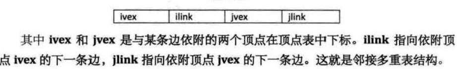

## 概述

顶点的有穷非空集合和顶点之间边的集合组成，通常表示为：G(V，E)。G表示一个图，V表示G中顶点的集合，E表示G中边的集合。

## 定义
图是一种比线性表和树更加复杂的数据结构。

- 在图中的数据元素称之为 顶点(Vertex).
- 图的顶点集合 有穷且非空
- 任意两个顶点之间都可能有关系，顶点之间的逻辑关系用边来表示。

## 图的存储结构

### 邻接矩阵

用两个数组来表示图。一个一维数组存储图中顶点信息，一个二维数组（邻接矩阵）存储图中的边或弧的信息。

### 邻接表

一种数组与链表相结合的存储方法。
这是一种避免空间浪费的存储结构，就像用`链表`来代替`线性表`节省内存一样。

### 十字链表

重新定义顶点表结点结构
十字链表的好处就是因为把邻接表和逆邻接表整合在一起，这样既容易找到以v为尾的弧，也容易找到以v为头的弧，因而比较容易求得顶点的出度和入度。

### 邻接多重表

多应用于对边的操作。因为需要找到这条边的两个边表节点进行操作，比较麻烦。

其示意图如下：

### 边集数组

由两个一维数组组成，一个存储顶点信息，另个存储边信息。每个边组数据元素有一个边的起点下标begin、终点下标end和权值weight。

## 图的遍历

图的遍历和树的遍历类似，希望从图中某一顶点出发访遍图中其余顶点，且使每一个顶点仅被访问一次，这一过程就叫图的遍历。图有两种遍历次序方案：

- 深度优先遍历:也有称为深度优先搜索，简称DFS
- 广度优先遍历： 也称广度优先搜索，简称BFS。

## 最小生成树

构造连通图的最小代价生成树，可以通过 `普里姆(Prim)算法` 或者 `克鲁斯卡尔(Kruskal)算法`  求出。

## 最短路径

非网图： 两顶点之间经过的边数最小的路径。
网图： 两顶点之间经过的边上权值之和最少的路径。路径上的第一个顶点称为源点，最后一个顶点是终点。

用于计算一个节点到其他所有节点的最短路径。通常使用算法有
- `迪杰斯特拉(Dijkstra)算法`，时间复杂度O(n^3)。
- `弗洛伊德(Floyd)算法`，时间复杂度O(n^3)，相对优雅。

##   拓扑排序

拓扑排序就是对一个有向图构造拓扑序列的过程。拓扑排序是一种图论算法。

> 拓扑排序是对有向无环图的顶点的一种排序，它使得如果存在一条从顶点A到顶点B的路径，那么在排序中B出现在A的后面。

[拓扑排序的原理及实现](http://blog.csdn.net/jasmine_shine/article/details/43488895)

## 关键路径

AOV： 在一个表示工程的有向图中，用顶点表示事件，用有向边表示活动。用边上的权值表示活动的持续时间，这种有向图的边表示活动的网，我们称之为AOV(Activity on edge network)
