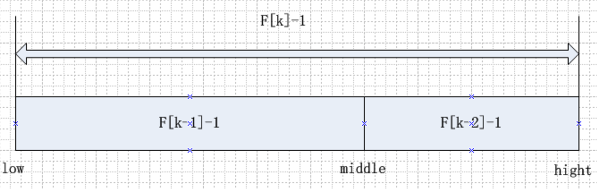

## 概念

定义：根据给定的某个值，在查找表中确定一个其关键字等于给定值的数据元素或记录

-  查找表： 同一类型数据元素构成的集合
-  查关键字：数据元素中某个数据项的值，用它可以标识一个数据元素

常见的查找算法包含七种，七种二分查找、插值查找以及斐波那契查找都可以归为一类——插值查找。
插值查找和斐波那契查找是在二分查找的基础上的优化查找算法。

查找表分类：
-  静态查找表： 只有查找操作的查找表
-  动态查找表： 在查找过程中，A)插入查找表中不存在的数据元素，B)从查找表中删除已经存在的某个数据元素。

查找算法分类：
- 无序查找：被查找数列有序无序均可；
- 有序查找：被查找数列必须为有序数列。

关于七大查找算法：
- [七大查找算法](http://weibo.com/ttarticle/p/show?id=2309403987428934350297&sudaref=www.google.com&retcode=6102)
- [[Data Structure & Algorithm] 七大查找算法](http://www.cnblogs.com/maybe2030/p/4715035.html#_label4)

## 顺序表查询

又叫线性查找，是最基本的查找技术，从头到尾逐个比较查找。
适合于存储结构为顺序存储或链接存储的线性表，是一种无序查找算法。
时间复杂度为： O(N)

Java实现代码：

## 有序表查找

用有序表查找方法时，前提条件是待查找的记录必须是已经排好序的。

### 折半查找（二分查找）

> 对于静态查找表，一次排序后不再变化，折半查找能得到不错的效率。
但对于需要频繁执行插入或删除操作的数据集来说，维护有序的排序会带来不小的工作量，那就不建议使用。

折半查找是最经典的有序表查找，要求线性表有序和采用顺序存储，如果是无序的则要先进行排序操作。

时间复杂度为：O(log2(n+1)) - O(log2n)

Java实现代码：

### 差值查找

二分法查找的改进(在折半查找中，每次都折一半，但是像我们查字典，首字母是a的肯定不会在中间差)，适用于关键字分布比较均匀的查找表
根据要查找的关键字key 与查找表 中 最大最小记录的关键字比较后的查找方法，核心在于差值计算公式。
mid = low + (key - a[low]) / (a[high] - a[low]) * (high - low)。

时间复杂度为： O(log2(log2n))

Java实现代码：

###  斐波那契查找

斐波那契数列，又称黄金分割数列，随着斐波那契数列的递增，前后两个数的比值会越来越接近0.618。

斐波那契查找就是在二分查找的基础上根据斐波那契数列进行分割的。

基本思想： 通过运用黄金比例的概念在数列中选择查找点进行查找，提高查找效率。同样地，斐波那契查找也属于一种有序查找算法。

时间复杂度为： O(log2n)

Java实现代码：

## 线性索引查找

索引是对于按先后顺序存储的海量数据，为了加快查找速度而设计的一种查找结构.

索引：把一个关键字与它对应的记录相关联的过程，一个索引由若干个索引项组成。

按结构分类：线性索引，树形索引，多级索引。

线性索引又分为：稠密索引，分块索引，倒排索引。

### 稠密索引

是指在线性索引中，数据集中的每个记录对应一个索引项

特点：记录无序，索引表中的索引项（按关键字）有序，索引项包含2个数据项：a.关键字，b.指针
缺点：索引项个数与数据集中的记录个数相同，空间代价大。

### 分块索引

把数据集的记录按分块有序的原则分成若干块，每一块对应一个索引项

特点：分块有序：
> a.块内无序，块内记录可以无序，
> b.块间有序，块与块之间按关键字有序。

- 索引项包含3个数据项：a.最大关键字，b.快中的记录个数，c.指向块首数据元素的指针。

### 倒排索引

根据属性（字段、次关键码）的值来查找记录，不是由记录确定属性值，而是由属性值确定记录的位置

优点：查找记录非常快。
缺点：记录表号不定长，维护（插入删除等）比较困难。

## 二叉排序树

又称二叉查找树.
顺序线性表的查找快速( 可以用折半，差值，斐波那契)，但是 插入和删除比较慢、二叉排序树就是为了解决这个问题的。

二叉排序树要么是一个空树，要么具有一下特点：

- 若左子树不为空，则左子树上所有节点的值均小于它的根结构的值。
- 若右子树不为空，则右子树上所有节点的值均大于它的跟结构的值。
- 它的左，右子树也分别为二叉排序树。

## 平衡二叉树（AVL树）

是一种二叉排序树，其中每一个节点的左子树和右子树的高度差至多等于1.
这是为了解决 树太高 会导致 查找效率变低。

## 多路查找树 （B树）

每一个节点的孩子数可以多余两个，且每一个节点处可以存储多个元素。由于它是查找树，所有的元素之间存在某种特定的排序关系。
包含了四种形式：

-  2-3树： 每一个节点都具有2个到3个孩子
-  2-3-4树： 2结点或3结点或4结点
-  B树：平衡的多路查找树，2-3，2-3-4都是B树的特例。节点的最大孩子数目称为 B 树的阶
-  B+树： 应文件系统所需而出现的一种B树的变形，解决了所有元素遍历等基本问题

## 散列查找

散列技术是在记录的存储位置和它的关键字之间建立一个确定的对应关系f，使得每个关键字key对应一个存储位置f(key)。
用散列技术将记录存储在一块连续的存储空间中，该存储空间称为散列表或者 哈希表（HashTable）。

特点：
- 不用比较，直接通过关键字key得到要查找记录的存储位置。
- 散列技术既是一种存储方法，也是一种查找方法。
- 散列技术最适合的求解问题是查找与给定值相等的记录。

散列函数的构造方法需要遵循以下原则：

> a.计算简单，
> b.散列地址分布均匀

### 常用散列函数构造方法

- 直接定址法
- 数字分析法
- 平方取中法
- 折叠法
- 除留余数法
- 随机数法

## 处理散列冲突的方法

- 开放定址探测法
- 再散列函数法
- 链地址法
- 公共溢出区法
