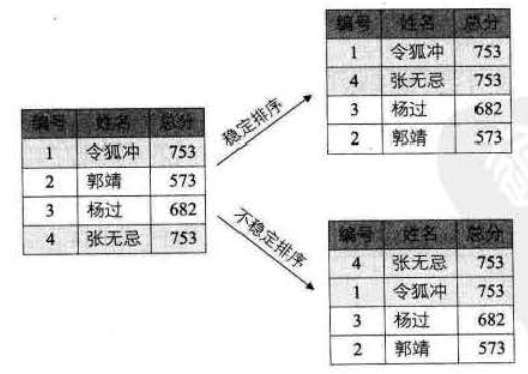

## 概述

使得一个序列成为按关键字有序的序列的操作。
在排序过程中，我们输入的是一个记录集合，输出的也是一个记录集合，因此，可以将排序看成是线性表的一种操作。

## 排序稳定性

待排序的序列中可能存在两个或者两个以上的记录相等的情况，
排序前和排序后其顺序不变的是稳定排序、

## 内排序和外排序
指待排序所有记录是否在内存中操作。

内排序：在排序整个过程中，待排序的所有记录都被放置在内存中（插入、交换、选择和归并）
外排序：排序记录态度要在内外存之间多次交换。

内排序主要受三个方面影响：

-  时间性能
-  辅助控件
-  算法的复杂性

## 冒泡排序

依次比较相邻的两个数，将小数放在前面，大数放在后面。

代码实现：

### 复杂度分析

- 最好的情况： 本身就是有序的，需要 n-1 次比较
- 最坏的情况： 逆序，需要 n(n-1)/2 次比较
因此，总的时间复杂度为 O(n^2)。

## 简单选择排序

第一个元素依次和后面的所有元素进行比较。第一次结束后，就会有最小值出现在最前面。依次类推。

代码实现：

特点：
- 交换移动数据次数较少。
- 最好、最坏的情况比较次数相同：n(n-1)/2，最好0次，最差n-1次
因此，时间复杂度依旧为O(n^2)。

## 插入排序

将n个元素的数列分为已有序和无序两个部分，
每次处理就是将无序数列的第一个元素与有序数列的元素从后往前逐个进行比较，找出插入位置，将该元素插入到有序数列的合适位置中。

代码实现：

## 希尔排序

先取一个小于n的整数d1作为第一个增量，把文件的全部记录分成（n除以d1）个组。
所有距离为d1的倍数的记录放在同一个组中。
先在各组内进行直接插入排序；
然后，取第二个增量d2<d1重复上述的分组和排序，直至所取的增量dt=1(dt<dt-l<…<d2<d1)，
即所有记录放在同一组中进行直接插入排序为止。

代码实现：

## 归并排序

将两个已经排序的序列合并成一个序列的操作。

代码实现：

## 堆排序

堆排序利用了大根堆（或小根堆）堆顶记录的关键字最大（或最小）这一特征，使得在当前无序区中选取最大（或最小）关键字的记录变得简单。

代码实现：

## 快速排序

1）设置两个变量i、j，排序开始的时候：i=0，j=N-1
2）以第一个数组元素作为关键数据，赋值给key，即 key=A[0]、
3）从j开始向前搜索，即由后开始向前搜索（j=j-1即j--），找到第一个小于key的值A[j]，A[i]与A[j]交换
4）从i开始向后搜索，即由前开始向后搜索（i=i+1即i++），找到第一个大于key的A[i]，A[i]与A[j]交换； 　　
5）重复第3、4、5步，直到 I=J，(3,4步是在程序中没找到时候j=j-1，i=i+1，直至找到为止。找到并交换的时候i， j指针位置不变。另外当i=j这过程一定正好是i+或j-完成的最后令循环结束。

代码实现：
